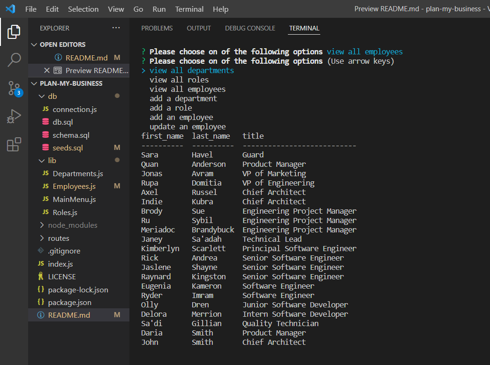

# Plan My Business

## Description
- Developers frequently have to create interfaces that allow non-developers to easily view and interact with information stored in databases. So I created an app that can allow user to view and controll data base of employees of the business they own
- I also build this app to improve my skills with SQL type database
-  
- I learned how to create connection between user interface and database

## Table of Contents

- [Installation](#installation)
- [Usage](#usage)
- [Credits](#credits)
- [License](#license)

## Installation

To instal the app you need to clone repository to local machine, run "npm i" to install all pachages and after start the app with "node index.js". After you will be presented with menu of options to view, write and update some data from database.

## Usage

)

[Video of usage](https://drive.google.com/file/d/1Kmv461N-LzWviO39cACCWJpDWk0NU7rN/view)

## Credits

## License

[Link to license: MIT](https://opensource.org/licenses/MIT)
## Badges

## Questions

Here is link to my GitHub profile page: https://github.com/sergiionyx

And also you may contact me via e-mail: twilight.cympak@gmail.com
